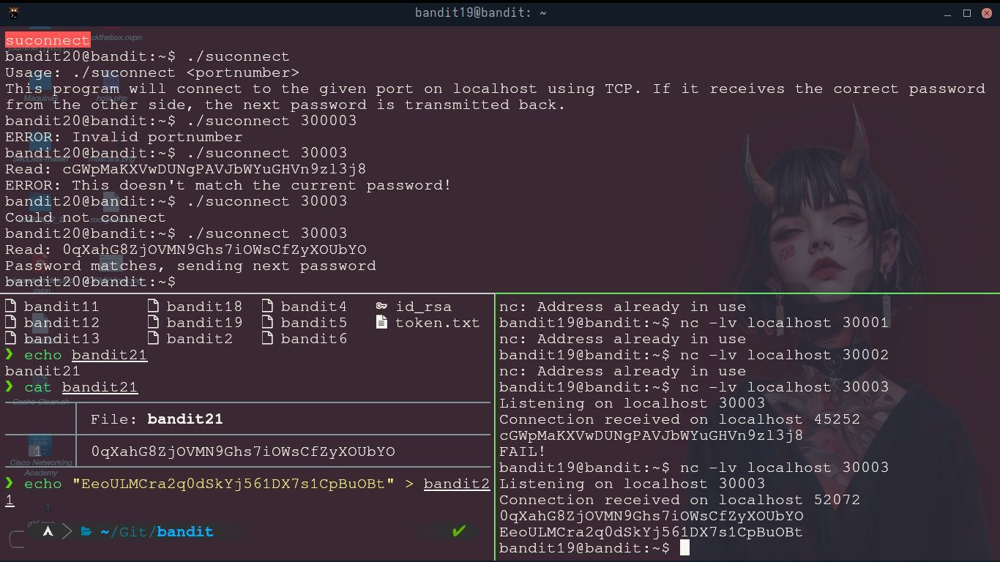
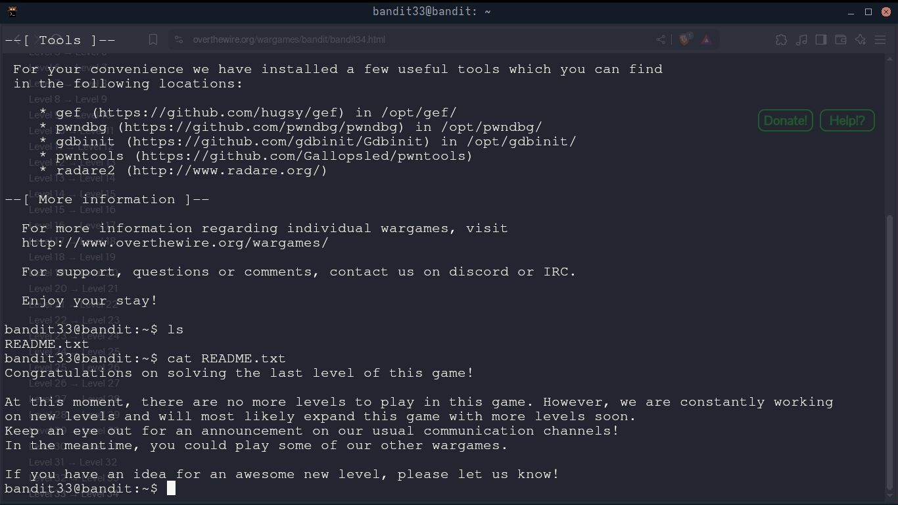

# OverTheWire: Bandit Wargame – Solución Nivel por Nivel

Este documento detalla cómo resolví todos los niveles del wargame [Bandit](https://overthewire.org/wargames/bandit/) 
de OverTheWire, diseñado para enseñar fundamentos de seguridad, Linux, y línea de comandos.

> ⚠️ **Importante:** No se incluyen contraseñas ni soluciones sensibles, en cumplimiento con las 
reglas del sitio.


Cada nivel se conecta con:

```bash
ssh bandit<NIVEL>@bandit.labs.overthewire.org -p 2220
```

Completar el wargame Bandit fue una experiencia fundamental para reforzar mis conocimientos 
en entornos Linux, scripting, redes y técnicas básicas de ciberseguridad.

 A lo largo de los niveles, enfrenté desafíos progresivos que me exigieron comprender y aplicar herramientas
reales de administración y análisis en sistemas Unix.

Este reto no solo fortaleció mi dominio de la terminal, sino también mi capacidad para resolver
problemas de forma lógica, estructurada y autónoma. Es un recurso altamente recomendable
para cualquier persona que quiera iniciarse en seguridad ofensiva, análisis forense o
administración de sistemas.
Este repositorio representa mi progreso y compromiso con el aprendizaje práctico en ciberseguridad.








Aqui estan los comandos que utilicé en cada nivel:


##  ✅ Niveles

# Nivel 0 → Nivel 1
Objetivo: Encontrar la contraseña almacenada en un archivo.


```bash
ls
cat readme
```

# Nivel 1 → Nivel 2
Objetivo: Archivo oculto.

```
ls -a
cat .hidden
```

# Nivel 2 → Nivel 3
Objetivo: Archivo con espacios en el nombre.

```
ls
cat "spaces in this filename"
```


# Nivel 3 → Nivel 4
Objetivo: Buscar un archivo con permisos específicos.


ls -la inhere/
cat inhere/.hidden

# Nivel 4 → Nivel 5
Objetivo: Buscar un archivo legible, de 1033 bytes, no ejecutable.


find inhere/ -type f -size 1033c ! -executable -exec cat {} \;

# Nivel 5 → Nivel 6
Objetivo: Archivo con permisos exactos.

find inhere/ -type f -readable -size 1033c ! -executable -exec cat {} \;

# Nivel 6 → Nivel 7
Objetivo: Buscar por usuario y grupo.


find / -user bandit6 -group bandit6 -size 33c 2>/dev/null -exec cat {} \;

# Nivel 7 → Nivel 8
Objetivo: Buscar una línea específica en un archivo.

cat data.txt | grep millionth

# Nivel 8 → Nivel 9
Objetivo: Extraer cadenas legibles.


strings data.txt | grep ===

# Nivel 9 → Nivel 10
Objetivo: Buscar líneas únicas.


sort data.txt | uniq -u

# Nivel 10 → Nivel 11
Objetivo: Decodificar base64.

cat data.txt | base64 -d

# Nivel 11 → Nivel 12
Objetivo: Decodificar ROT13.


cat data.txt | tr 'A-Za-z' 'N-ZA-Mn-za-m'


# Nivel 12 → Nivel 13
Objetivo: Archivos múltiples anidados y comprimidos.


xxd -r data.txt > file
### Luego, usar: file, tar, gzip, bzip2, etc. paso a paso
# Ejemplo:
file file
mv file file.gz
gunzip file.gz
# repetir análisis y descompresión hasta encontrar la contraseña


# Nivel 13 → Nivel 14
Objetivo: Conectarse usando una clave privada SSH.

chmod 600 sshkey.private
ssh -i sshkey.private bandit14@localhost

# Nivel 14 → Nivel 15
Objetivo: Enviar contraseña al puerto correcto.

cat /etc/bandit_pass/bandit14 | nc localhost 30000


# Nivel 15 → Nivel 16
Objetivo: Conexión SSL.

openssl s_client -connect localhost:30001
# pegar la contraseña y buscar respuesta


# Nivel 16 → Nivel 17
Objetivo: Escanear puertos.

nmap -p31000-32000 localhost
# probar puertos abiertos con openssl o netcat


# Nivel 17 → Nivel 18
Objetivo: Encuentra una contraseña escrita por un script.


cat /var/spool/bandit17/password


# Nivel 18 → Nivel 19
Objetivo: Conexión inmediata con redirección.


ssh -t bandit18@bandit.labs.overthewire.org -p 2220 "cat /etc/bandit_pass/bandit19"


#  Nivel 19 → Nivel 20
Objetivo: Crear un archivo con nombre especial.


mkdir /tmp/mi_tmp
cd /tmp/mi_tmp
echo "texto" > "--"
./bandit20-do cat /etc/bandit_pass/bandit20


# Nivel 20 → Nivel 21
Objetivo: Crear un servidor que reciba una conexión.


nc -lvp 4444
./suconnect 4444


# Nivel 21 → Nivel 22
Objetivo: Encontrar un cronjob.

ls -la /etc/cron.d/
cat /etc/cron.d/cronjob_bandit22
cat /usr/bin/cronjob_bandit22.sh


# Nivel 22 → Nivel 23
Objetivo: Revisar cronjobs y manipular salida.


cat /usr/bin/cronjob_bandit23.sh
# leer desde el archivo en /tmp
cat /tmp/XXYYZZ


# Nivel 23 → Nivel 24
Objetivo: Usar cron para escribir en un archivo.


echo "cat /etc/bandit_pass/bandit24 > /tmp/mi_pass" > /tmp/mi_script.sh
chmod +x /tmp/mi_script.sh
mkdir /tmp/mi_dir
echo "/tmp/mi_script.sh" > /tmp/mi_dir/cronjob_bandit24


# Nivel 24 → Nivel 25
Objetivo: Ejecutar binario con argumentos falsos.


./bandit24 -u bandit24
# o inyectar args desde archivo bash wrapper


# Nivel 25 → Nivel 26
Objetivo: SSH trick para cambiar el comando ejecutado.

ssh bandit25@localhost -p 2220 -t "cat /etc/bandit_pass/bandit26"


# Nivel 26 → Nivel 27
Objetivo: Usar setuid y temporales.


./bandit26
# analizar comportamiento y abusar de /tmp


# Nivel 27 → Nivel 28
Objetivo: Leer desde un archivo git oculto.


cd /bandit27-git
git log
git show HEAD:README

# Nivel 28 → Nivel 29
Objetivo: Buscar en ramas y commits.


git branch -a
git checkout dev
git log


# Nivel 29 → Nivel 30
Objetivo: Buscar en los tags.

git tag
git show <tag>


# Nivel 30 → Nivel 31
Objetivo: Buscar en el historial de commits.


git log
git show <commit>


# Nivel 31 → Nivel 32
Objetivo: Buscar en stash.


git stash list
git stash show -p


# Nivel 32 → Nivel 33
Objetivo: Leer un archivo oculto en el sistema de archivos.


cd /root
ls -la


# Nivel 33 → Nivel 34
Objetivo: Ejecutar un binario SUID.


./bandit33
# o revisar scripts asociados


# Contacto

Github:  [AlejandroXYZ](https://www.github.com/AlejandroXYZ)

Linkedin: [Alejandro Moncada](https://linkedin.com/in/alejandroxyz)

Correo:   [Correo](mailto:alejandromdekuedit@gmail.com)
 
