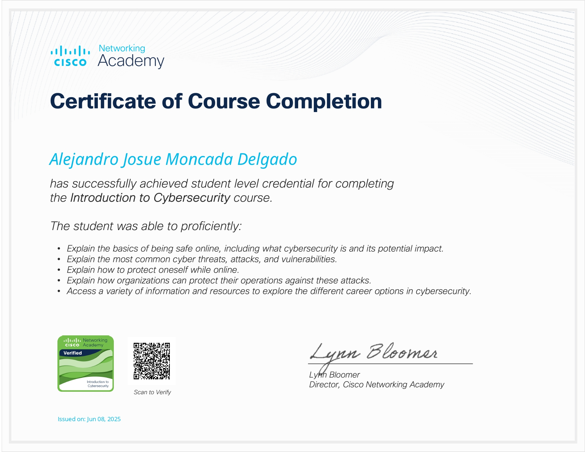
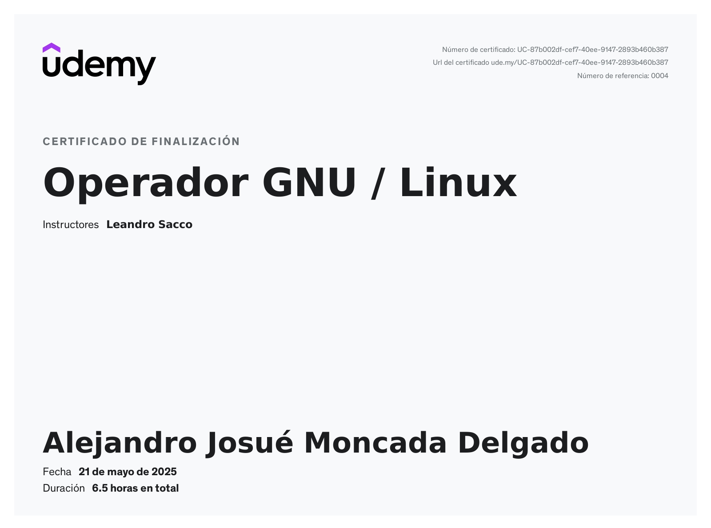
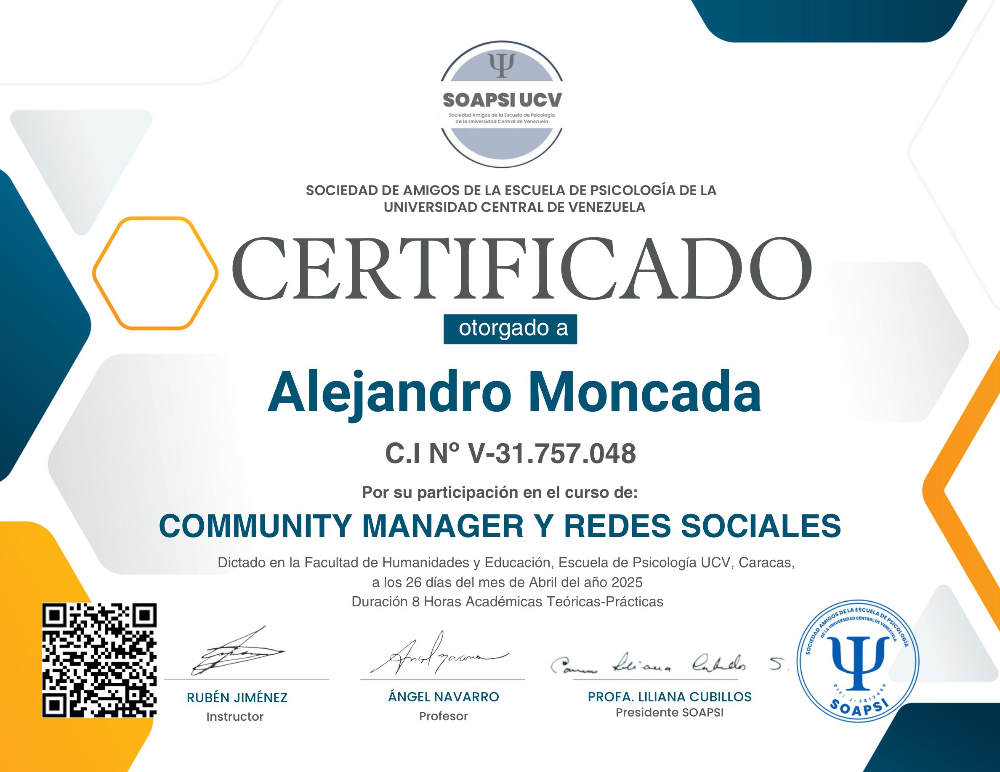

## 🏆 Certificaciones

### **Cisco Academy - Introduction to Cybersecurity**
[  

**Link de Comprobación:**  (https://www.credly.com/badges/29aa5ad3-5735-40e2-a36e-78e429bda9da)
**Fecha**: Junio 2025
**Horas:**  6 horas  
#### Qué aprendí:
  
-  Conceptos fundamentales y Administración de Cyberseguridad
-  Defensa de la red y ataques comunes
-  Analizar Vulnerabilidades y Salvaguardar un sistema

---

### **Udemy - Operador GNU/LINUX**
  

**Link de Comprobación:**  (ude.my/UC-87b002df-cef7-40ee-9147-2893b460b387)
**Fecha**: Mayo 2025
**Horas:**  6 horas
  
#### Aprendizaje:
  
-  Comandos básicos y avanzados de **Linux** y **Bash scripting**
-  Administración de sistema, servicios y procesos 
-  Gestión de Cuentas, usuarios, grupos y software 

---

### **Universidad Central de Venezuela - Community Manager y Redes Sociales**
  

**Link de Comprobación:**  (http://soapsi.org/wp-content/CM26Abril-AlejandroMoncada.png)
**Fecha**: Abril 2025
**Horas:**  8 horas
  
#### Aprendizaje:
  
-  Gestión de Redes Sociales
-  Creación de Contenido
-  Interacción con la Audiencia
-  Construcción de Comunidad y Estrategias de Comunicación
---
