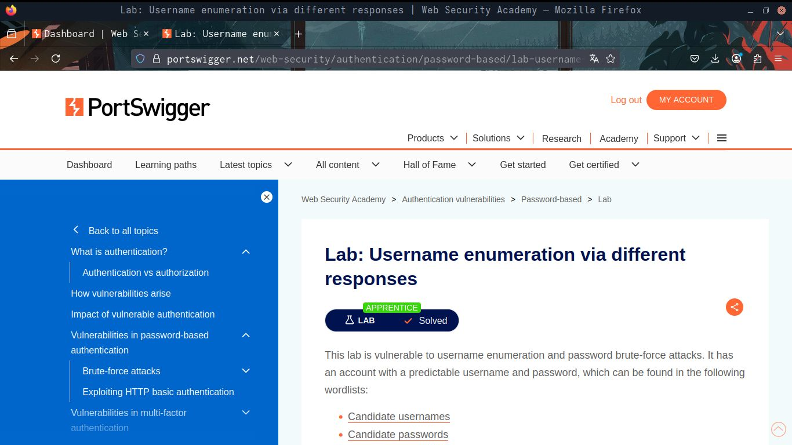
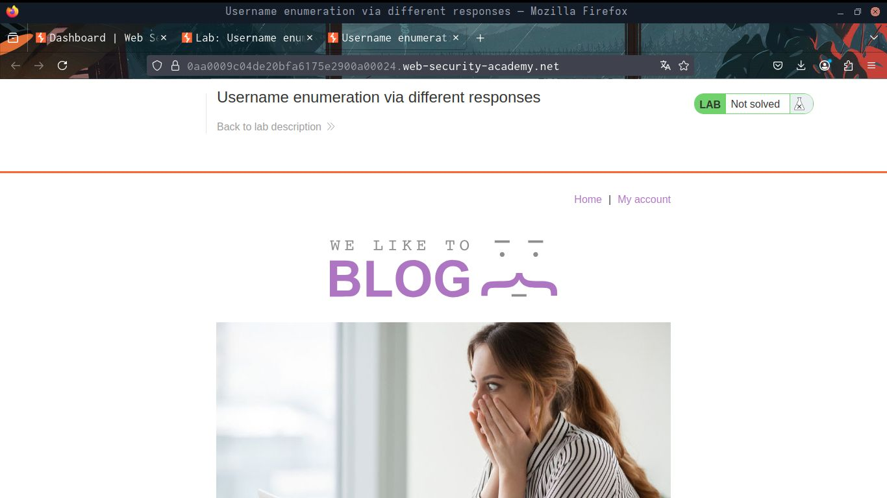
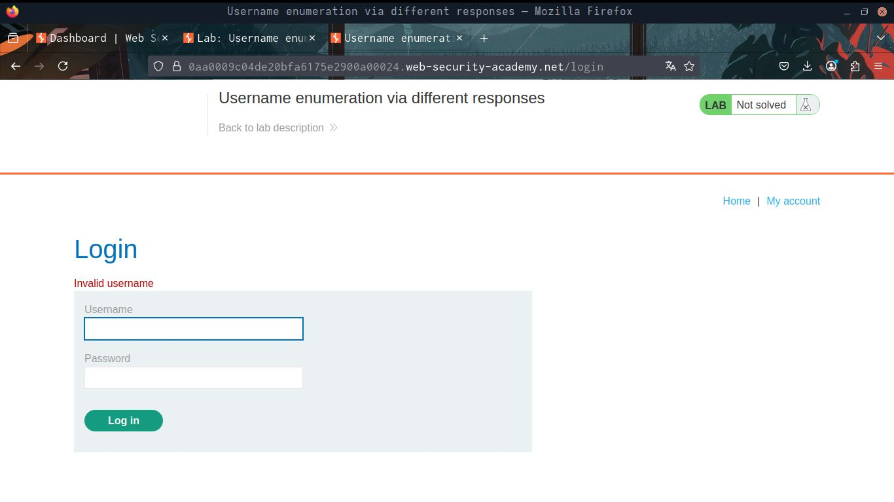
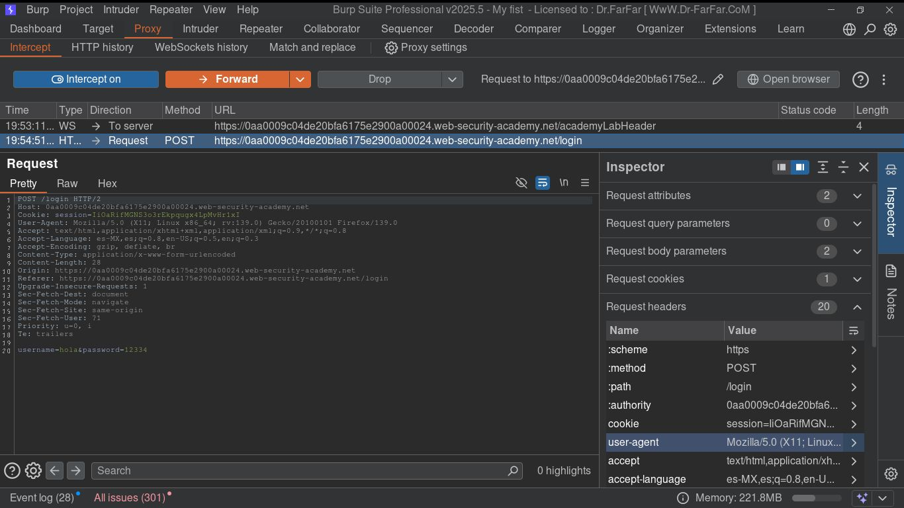
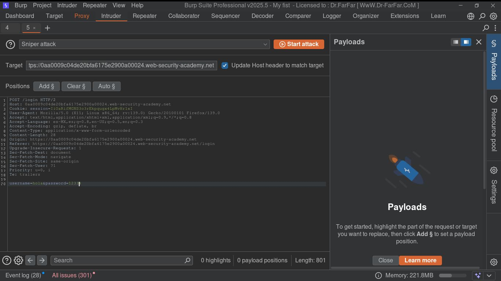
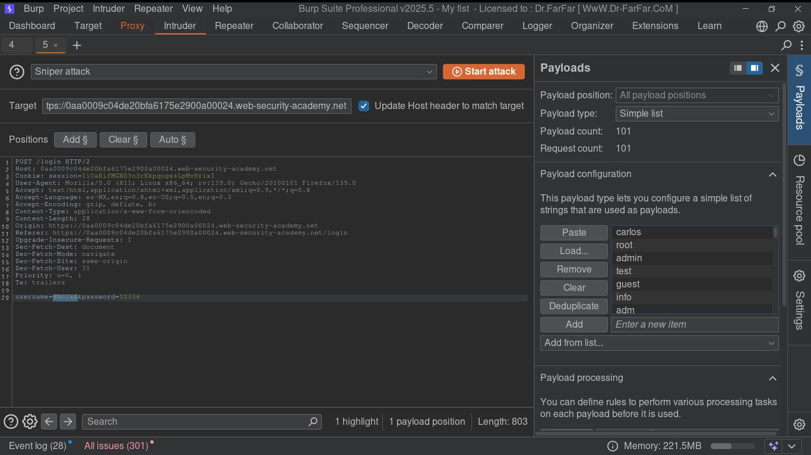
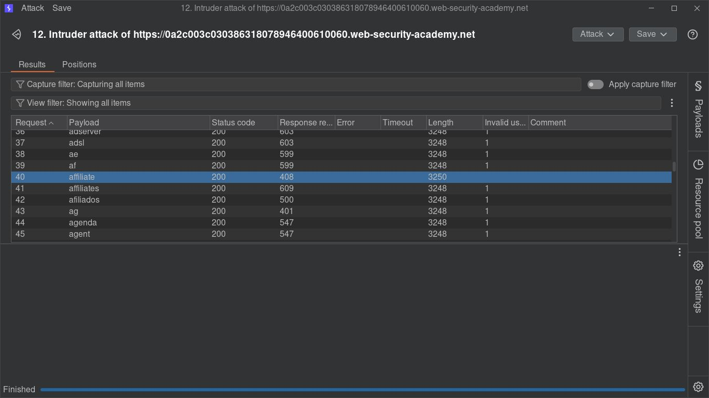
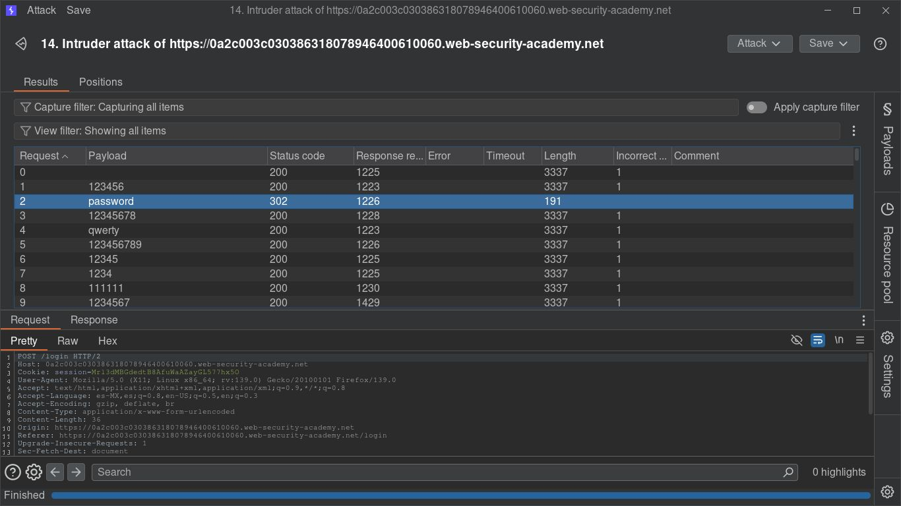

# Enumeración de Usuarios por respuestas



Esta es un Laboratorio de Portswigger Academy el cual con una lista de usuarios y contraseñas se 
realiza un ataque de fuerza bruta a un formulario de inicio de sesión ( Login ) hacia un sitio web inseguro,
para esto estaré utilizando la herramienta Burpsuite.


# Iniciando el laboratorio

Al iniciar el laboratorio veremos esto:



luego nos dirigimos a "My Account"

y veremos un formulario de Login:


Intentaremos Logearnos con un usuario y una contraseña aleatorio



Vemos que nos dice: "Invalid username", esto es importante tenerlo en cuenta porque lo utilizaremos
más adelante.


# Explotación

En la página donde iniciamos el laboratorio nos proporcionan una lista de usuarios y contraseñas para 
utilizar en un ataque de fuerza bruta.

Primero copiaremos todos los nombres de usuarios, ya que cuando accedemos con un usuario incorrecto la
misma web nos avisa, por lo que podemos aprovecharnos de esto

Posteriormente nos abrimos Burpsuite para empezar con el ataque de fuerza bruta, para poder utilizar
correctamente Burpsuite tienes que haberlo configurado en el navegador como proxy y proporcionarle el
certificado

Una vez Burpsuite esté abierto activamos la opción de **"Intercept"** para interceptar las peticiones
y así poder editar las cabeceras.

Cuando Burpsuite tenga el "Intercept" activado, nos intentamos logear de nuevo en la web para interceptar
la petición



Una vez interceptada la petición del login  en Burpsuite, enviamos la petición a **"Intruder"** con 
```CTRL_I``` y nos vamos a la seccion de intruder.



Primero nos aseguramos de que el tipo de ataque sea **Sniper**, luego en la última linea veremos algo como esto:

username=hola&password=12334

Primero queremos encontrar un usuario que exista apoyandonos de la respuesta que nos da el sitio web
asi que solo seleccionamos los datos del username, en este caso, seleccionamos "hola" y le damos a add


En donde dice Payload Configuration, pegamos los nombres de usuarios que copiamos anteriormente



Luego tocamos donde dice **Options** al lado del **Payload**, y buscamos la opción de **"Grep Match"**,
le damos al botón "Clear", y recordemos que anteriormente cuando colocabamos un usuario incorrecto,
la web nos decía que el usuario era incorrecto con este mensaje:

"Invalid username" 

Nos copiamos ese mensaje y lo agregamos en **"Grep Match"**.

Ahora sí iniciamos el primer ataque de fuerza bruta para encontrar el usuario, tocando el botón de 
"Start Attack"



Aquí como se ve en la captura, esa columna de numeros "1", es la columna del "Grep Match" que colocamos
anteriormente, el cual encuentra todas las coincidencias del texto que le colocamos el cual era "Invalid username",
si marca uno es que encontró este texto en el código fuente de la página web del login, por lo que
la que no marque ese numero 1, significa que no se encontró el texto de usuario inválido, por lo tanto,
significa que el usuario es correcto, ahora solo nos tocaría realizar lo mismo pero esta vez con la contraseña.


Procedemos a intentar logearnos como el usuario que conseguimos pero con una contraseña incorrecta
para capturar el texto de la contraseña incorrecta que utilizaremos posteriormente, nos dice "Incorrect password"
Nos copiamos las contraseñas que nos proporcionaron y procedemos a realizar el mismo ataque pero cambiando el foco a la password 



Y obtuvimos la password, aquí un punto importante es que todas las solicitudes con la contraseña incorrecta,
regresó un código 200, lo que significa "OK" y vuelve al html base imprimiendole el mensaje de error,
pero el codigo HTTP  de la contraseña correcta es el código "302", y este código se refiere a que hay un
un redirección de página,  en caso de que no puedas hacer un "Grep Match", verificar un código HTTP
diferente a la mayoría te podría ayudar.

Colocamos nuestras credenciales dentro del login y terminamos. :)


# Reporte

Este laboratorio práctico nos ha permitido comprender en profundidad la metodología de un ataque de
fuerza bruta a formularios de inicio de sesión utilizando la herramienta Burp Suite. A través de
la explotación de un sitio web inseguro, hemos logrado identificar nombres de usuario válidos y sus
contraseñas correspondientes, lo que subraya la importancia de implementar medidas de seguridad robustas

## Puntos Clave:

Reconocimiento y Análisis de Respuestas del Servidor: Un aprendizaje crucial fue cómo el sitio web
proporcionaba información útil a través de sus mensajes de error ("Invalid username" o "Incorrect
password"). Esta retroalimentación, aunque aparentemente inocua, fue fundamental para guiar el
ataque de fuerza bruta, permitiendo la identificación de usuarios existentes antes de pasar a
adivinar contraseñas.

Dominio de Burp Suite (Intruder): Hemos consolidado el uso de Burp Suite como una herramienta indispensable
para pruebas de penetración. Específicamente, la función "Intruder" demostró ser extremadamente 
potente para automatizar el envío de múltiples payloads (listas de usuarios y contraseñas) y
analizar las respuestas del servidor de manera eficiente.

Estrategias de Ataque por Etapas: El laboratorio resaltó la efectividad de un ataque de fuerza
bruta en dos fases:

Identificación de Usuarios Válidos: Utilizando la respuesta "Invalid username" y la función "Grep
Match" en Burp Suite, pudimos filtrar y encontrar usuarios legítimos dentro de una lista extensa.

Descubrimiento de Contraseñas: Una vez que tuvimos un usuario válido, el mismo principio de
"Grep Match" (o, en su defecto, el análisis de códigos de estado HTTP como 302 Redirect para una
contraseña correcta) nos permitió adivinar la contraseña asociada.

Importancia de los Códigos de Estado HTTP: Se demostró cómo los códigos de estado HTTP, en
particular el 302 (Found/Redirect), pueden ser un indicador clave de una autenticación exitosa,
incluso cuando los mensajes de error textuales no son tan explícitos.

Vulnerabilidades Comunes en Formularios de Login: El laboratorio sirvió como un claro recordatorio de
que los formularios de inicio de sesión son puntos de ataque frecuentes si no se implementan
salvaguardas como bloqueos de cuentas tras múltiples intentos fallidos, CAPTCHAs o autenticación 
multifactor.


# Conclusión


Este laboratorio no solo nos proporcionó las habilidades técnicas para ejecutar un ataque de fuerza
bruta, sino que también nos inculcó una mayor conciencia sobre la importancia de la seguridad en
las aplicaciones web y la necesidad de proteger la información de los usuarios contra este tipo
de ataques.


