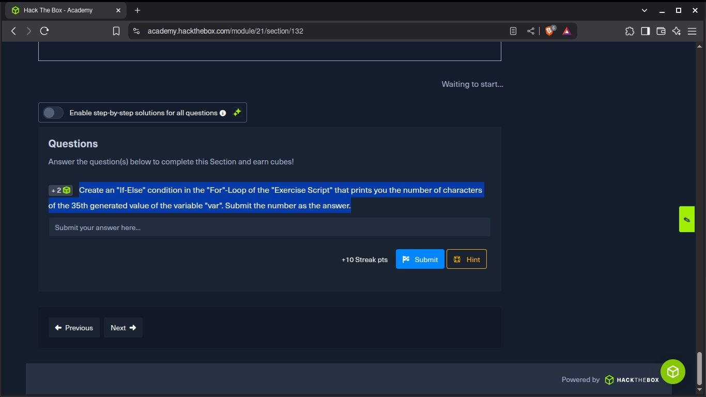

# Scripting en bash ( ROOM de Hackthebox )

Completé este room para practicar lo básico en scripting en bash con clases de hackthebox academy,

En el primer ejercicio llamado **"Conditional Execution"**, realicé un script básico en bash que:

Pedía lo siguiente

Basicamente lo que me pedía era que hiciera un script que codificara el valor de la variable "var" 35
veces en base64 y luego contara el número de carácteres del output.

## Este fue el resultado:

