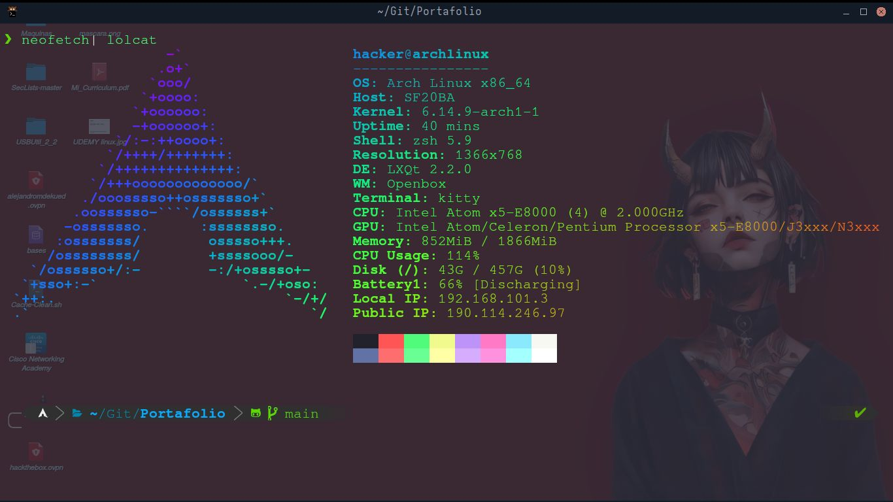

# 🧠 Portafolio de Proyectos | AlejandroXYZ | Alejandro Moncada

¡Bienvenido/a a mi portafolio de proyectos en GitHub!

Soy un estudiante/apasionado por la tecnología con enfoque en **ciberseguridad, pentesting, desarrollo y análisis técnico**, que está en constante formación. Este repositorio es un espacio vivo donde voy documentando y mostrando los proyectos y herramientas que voy desarrollando mientras avanzo en mi camino profesional.

## 📝 Nota

Este portafolio está en construcción — igual que mi carrera profesional. Gracias por visitarlo y ser parte de este proceso de crecimiento

## Mi Entorno de Trabajo: 

> 🔧 A pesar de las limitaciones de hardware, continúo aprendiendo y desarrollando herramientas funcionales, demostrando que lo importante es aprender, la actitud y las ganas de superarse.

---

## 🚀 Objetivo del Repositorio

Este portafolio tiene como finalidad:

- Mostrar proyectos prácticos que he desarrollado (herramientas, scripts, análisis, pruebas de concepto, etc.).

- Demostrar mis habilidades técnicas y de aprendizaje autónomo.

- Servir como evidencia de mi progreso y compromiso con la tecnología.

- Atraer oportunidades laborales o de colaboración en el ámbito de IT y Ciberseguridad.

---

## 🧩 Proyectos actuales

| Proyecto             | Descripción                                                            | Tecnologías                 | Estado       |   Link     |
| -------------------- | ---------------------------------------------------------------------- | --------------------------- | ------------ | ------------ |
| `OmniPortScanner`    | Escáner de puertos simple y eficiente creado desde cero.               | Bash scripting, linux            | ✅ Terminado  | https://github.com/AlejandroXYZ/Omni-PortScanner|
| `Infobash`           | Herramienta educativa de Bash para añadir y aprender comandos de linux | Bash scripting              | 🔜En proceso | https://github.com/AlejandroXYZ/infobash|
| `BabelSQL`           | Diccionario español e inglés utilizando bases de datos                 | Bash scripting, SQLite      | ✅ Terminado | https://github.com/AlejandroXYZ/BabelSQL | 
| `Coming soon...`     | Iré añadiendo más proyectos y CTF sobre la marcha                      | Próximamente                |              |

---

## 🧠 Tecnologías y Áreas de Interés

Actualmente me estoy enfocando en aprender y practicar:

- 🛡️ Ciberseguridad y Pentesting (especialmente Hacking Web y IA )

- 🐍 Programación en Python

- 🛡️  Ciberseguridad y Pentesting aplicada a Inteligencia Artificial

---
## 🏅 Certificaciones

Encuentra mis **certificaciones y constancias de cursos** en la carpeta: [Certificaciones](./Certificaciones).

---
## 🤝 Contacto y colaboración

Estoy abierto a oportunidades de **prácticas, mentoría, colaboración en proyectos** o empleo en áreas afines a IT y ciberseguridad.

Si te interesa saber más sobre lo que hago o cómo puedo aportar a tu equipo, no dudes en contactarme:
LinkedIn https://LinkedIn.com/in/alejandroXYZ
correo alejandromdekuedit@gmai.com
celular: 0412-077-0944
