# Advent Of Cyber 2019

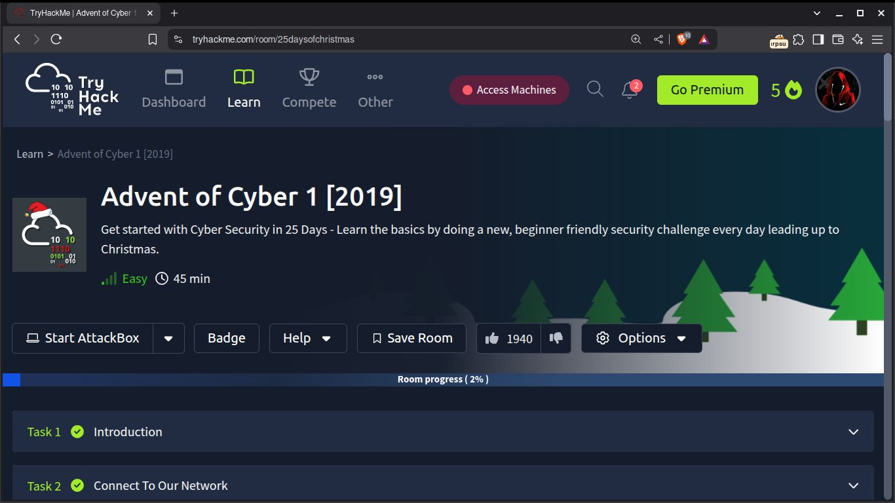

Estaremos realizando este reto de tryhackme, realizando un ataque web llamado  "Session Hijacking" (Secuestro de sesión)

##¿Qué es un Session Hijacking?

Es un tipo de ataque donde se roba el identificador de una sesión válida de un usuario y lo utilizamos
para suplantar la identidad de ese usuario y obtener acceso a su cuenta.

## Empezando el Ataque

Pues nos conectamos utilizando OpenVPN a Tryhackme y iniciamos la máquina, una vez hecho esto, el hacemos
un ping a la dirección IP de la máquina en mi caso es la **10.10.133.7**

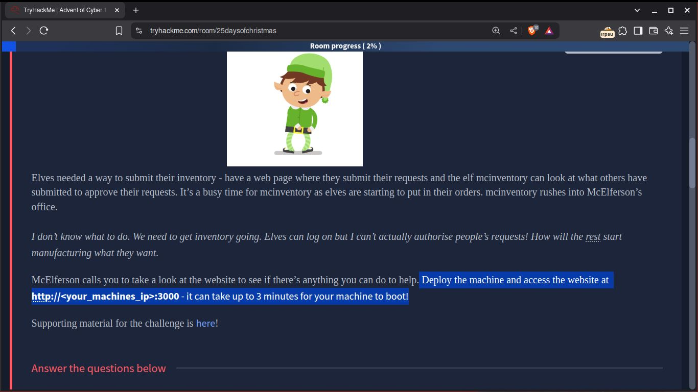

Nos pide acceder a la dirección IP de la Máquina victima desde nuestro navegador utilizando el puerto
**3000**

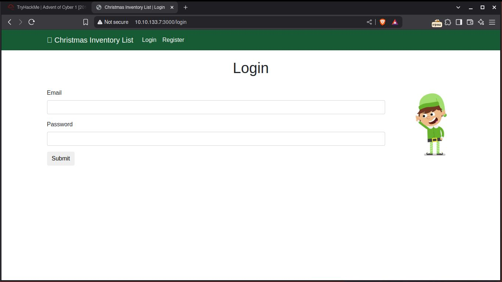 

Una vez dentro vemos una página de login, como no tenemos usuario ni contraseñas intentaremos registrarnos
como un nuevo usuario a ver si nos deja

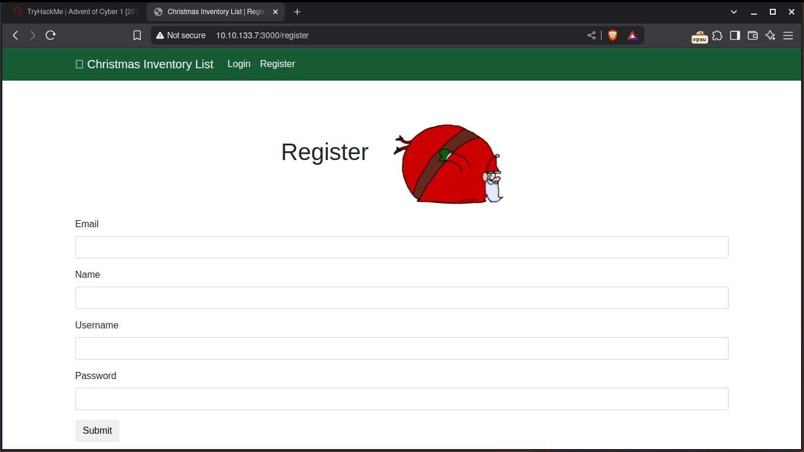

Nos registramos como normalmente haríamos en una página de login, con datos no falsos

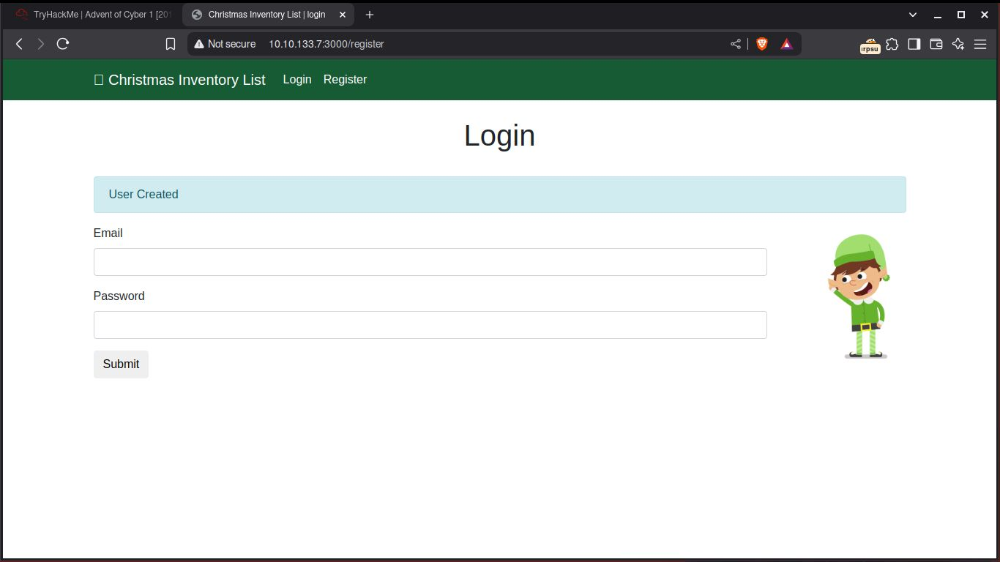

Como vemos se creó satisfactoriamente el usuario, entonces procedemos a iniciar sesión

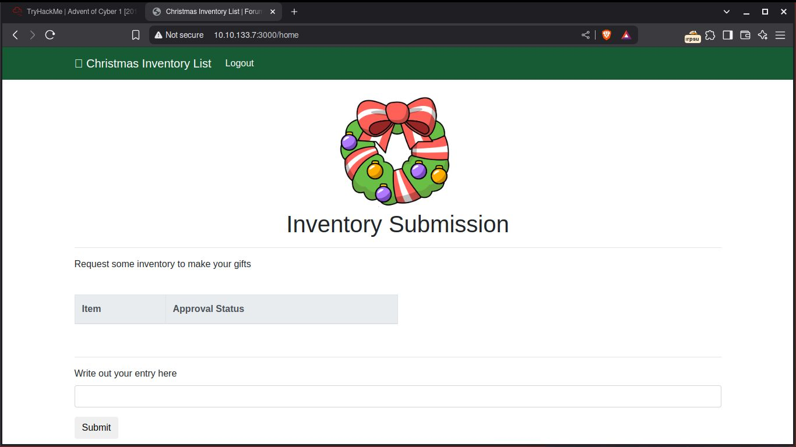

Esto es lo que aparece una vez dentro, como vimos podemos acceder como un usuario normal sin problemas,
en la página de Tryhackme si leemos un poco nos dice que el elfo "Mcinventory" es el encargado de 
aprobar las solicitudes que se envían, por lo cual nos da una pista. Mcinventory podría ser el usuario
administrador

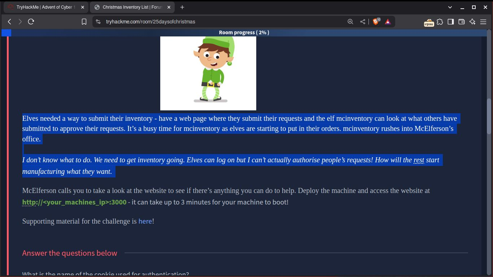


Aquí utilizaremos **"Burpsuite"** para interceptar las peticiones de login que realizaremos,
activamos la opción de interceptar en burpsuite y recargamos la página para capturar la petición y la cookie


En la cabecera HTTP, buscamos la Cookie, nos sale algo así:

```
Cookie: authid=dXNlcnY0ZXI5bGwxIXNz
```

Donde dice "authid", se refiere a que es una cookie de authenticación y tiene un valor id, el cual
está codificado en base64, burpsuite nos permite decodificarlo facilmente, seleccionamos el valor de
"authid" y lo decodificamos

Nos aparece algo así:

```
userv4er9ll1!ss
``` 

En la parte que dice "user", es el nombre de usuario que registré en la página anteriormente, y lo que
sigue que es: **"v4er9ll1!ss"**, es el valor ID de la cookie de autenticación de sesión, una medida de 
seguridad que utiliza la entropía (Pilar fundamental de la Criptografía).

Como sabemos que el usuario **admin** se llama "mcinventory", vamos a reemplazar nuestro nombre de usuario
por el de "mcinventory" en la cookie decodificada:

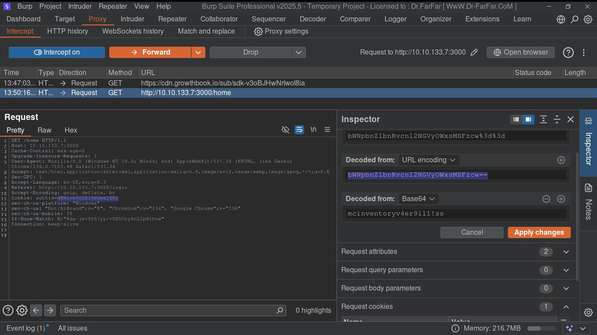

Luego copiamos la codificación base64 después de haber reemplazado el nombre de usuario y lo reemplazamos
en la Cabecera HTTP donde dice "Cookie", y procedemos a enviarlo tocando **Forward**

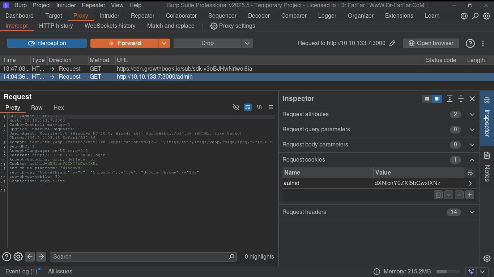

Nos aparece otra solicitud pero esta vez con un "GET /admin HTTP/1.1", aquí volvemos a reemplazar el
valor de la Cookie como hicimos anteriormente y le damos "Forward" para volver a enviar.

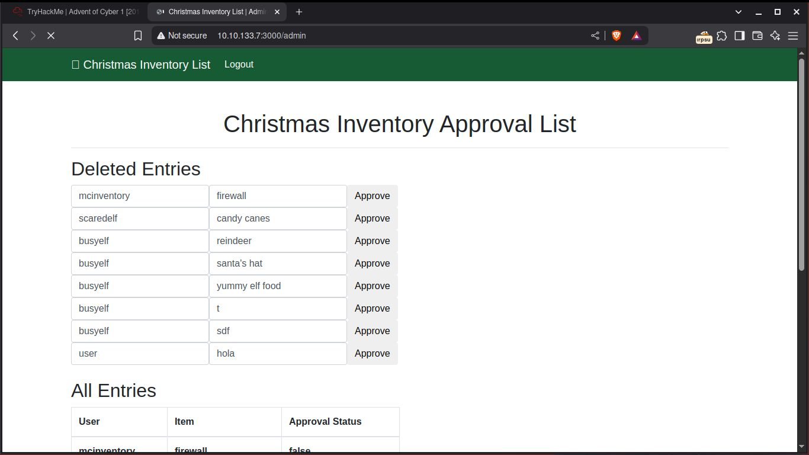

Si volvemos al navegador, vemos que ingresamos a la página como el usuario administrador y vemos 
información sobre solicitudes hechas, ya que logramos ingresar como usuario administrador, procedemos
a ingresar las "Flags" en TryHackMe

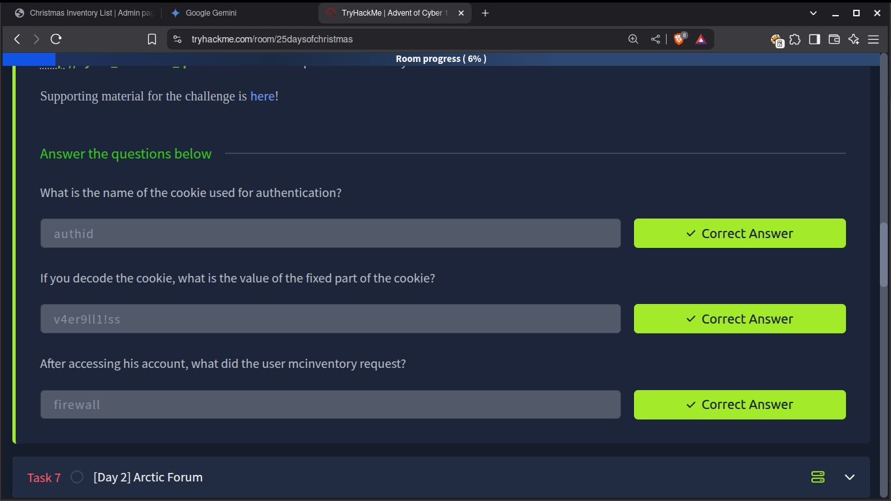


# Conclusión

En este laboratorio del "Advent Of Cyber 2019" de TryHackMe, hemos demostrado la vulnerabilidad de
las aplicaciones web frente al secuestro de sesión (Session Hijacking). A través de la intercepción 
y manipulación de cookies de sesión utilizando Burp Suite, logramos suplantar la identidad del 
usuario administrador "Mcinventory".

El proceso implicó comprender la estructura de la cookie de autenticación, decodificarla de Base64
modificar el valor del authid para reflejar el nombre de usuario deseado (mcinventory) y,
finalmente, codificarlo de nuevo en Base64 para reemplazar el valor original en la cabecera HTTP.

Este ataque exitoso subraya la importancia de implementar mecanismos robustos de gestión de sesiones que no
dependan únicamente de valores de cookies predecibles o fácilmente manipulables. La falta de una mayor entropía
o la ausencia de validación de la cookie con otros parámetros (como la dirección IP del usuario)
facilitaron el acceso no autorizado.

Este ejercicio nos ha proporcionado una valiosa experiencia práctica en la identificación y explotación de
debilidades en la autenticación web, destacando la necesidad crítica de proteger las sesiones de
usuario para mantener la integridad y confidencialidad de la información en entornos web.
