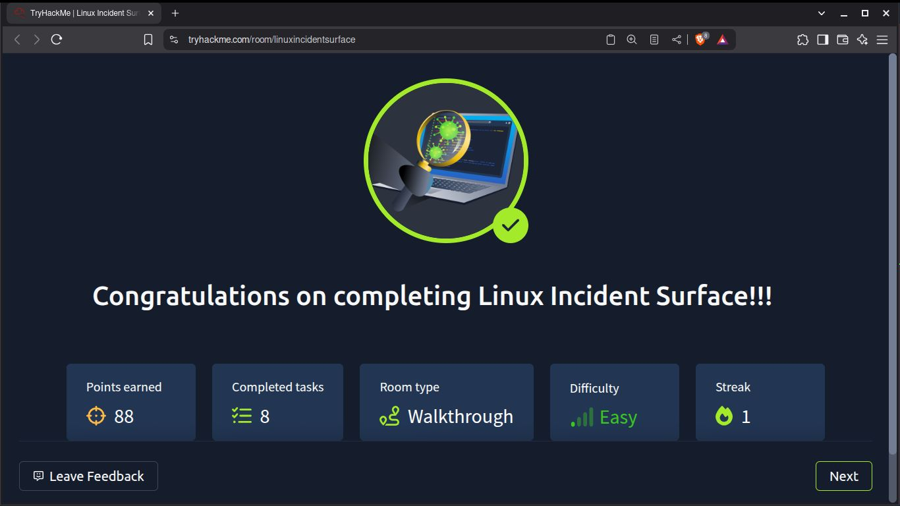
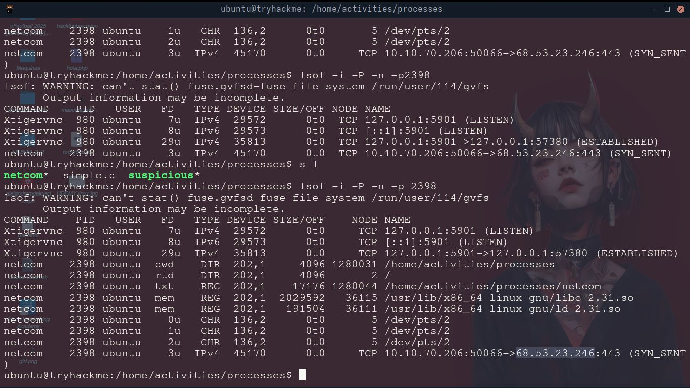

#  Superficies de incidentes en Linux




Completé esta  Room de TryHackMe la cual me enseñó donde puedo encontrar rastros de un incidente
informatico ya ocurrido o donde se podría realizar un incidente.


Conocer sobre este tema es muy util para saber como evitar ataques informáticos, evitar perder
información y datos importantes. También es muy útil para saber donde hay que buscar las huellas
de lo ocurrido, tal y como lo hace un detective, en este caso se buscan en logs, procesos
y conexiones realizadas. 

Por lo tanto, conocer sobre este tema es muy útil para prevenir posibles ataques y saber
responder y reaccionar ante un incidente informatico


# Superficie de Ataque y Superficie de Incidencia

El **Attack Surface ** (Superficie de Ataque), se refiere a los puntos de entrada potenciales que un
atacante busca para obtener acceso o causar daño


El **Incident Surface** (Superficie de Incidencia), Se refiere a todas las áreas del sistema que
están involucrados en la detección y respuesta a un incidente de seguridad real ( después de que
se ha producido una intrusión o compromiso).

  • **Superficie de Ataque**: Prevención( ¿Dónde podría entrar un atacante? )

  • **Superficie de Incidencia** : Detección y respuesta ( donde se manifiestan los problemas y cómo
  se gestionan)


# Primera Flag

Pide que ejecute un binario compilado en C llamado **Netcomm**, el cual es un proceso malicioso que se conecta a una máquina
en segundo plano

La misión era ver los procesos de conexiones con lsof y obtener información sobre este proceso y sus
conexiones




#### Para ver procesos y sus conexiones se ejecuta el comando:

```
lsof -i -P -n -p <PID del Binario>
```


lsof ( Comando para listar archivos abiertos por procesos, archivos, directorios, dispositivos, sockets 
de red, etc )

-i ( Información sobre conexiones y sockets )

-P ( Muestra los puertos utilizados por el proceso y sus números )

-n ( Muestra direcciones IP que responden al proceso )


## Procesos que podrían relacionarse con una Superficie de Incidente (Incident Surface)


	• Procesos  o Binarios corriendo desde el /tmp 
	• Procesos hijos sospechosos
	• Procesos con conexiones sospechosas
	• Procesos Huérfanos ( No siempre son maliciosos )
	• Sospechosos procesos corriendo desde una Cronjob


# Persistencia (Backdoors)

Se refiere a las acciones que hace un atacante después de escalar privilegios para mantener la
conexión con la máquina que fue comprometida para luego conectarse de nuevo facilmente. Algunos
ejemplos son:


### Crer un usuario en la máquina víctima

Podría crear un usuario en la máquina utilizando los siguientes comandos

```
$ sudo useradd atacante -G sudo
$ sudo passwd atacante
$ echo "atacante ALL=(ALL:ALL) ALL"| tee -a /etc/sudoers 
```

Aquí crea un usuario llamado "atacante" en el grupo "sudo", luego proporciona privilegios necesarios
añadiendolo al archivo sudoers

# Identificar Footprints ( Huellas )

Saber comprobar, analizar y gestionar los logs del sistema es muy importante, ya que estos archivos
contienen registros del sistema, errores , mensajes, advertencias, y intentos de autenticación.
Los logs se almacenan en el directorio: ```/var/log```, algunos logs importantes son:

	• auth.log
	• syslog
	• passwd
	• sudoers
	• groups
	• audit
	• kern.log
	• dmesg
	• cron


# Conclusión

Conocer sobre este tema es muy interesante para saber prevenir y reaccionar ataques ciberneticos e incidentes,
y las áreas clave para buscar son:

	• Procesos corriendo
	• Paquetes instalados
	• Servicios Corriendo
	• Conexiones Activas
	• Metodos Persistentes de Atacantes ( Backdoors )
	 
