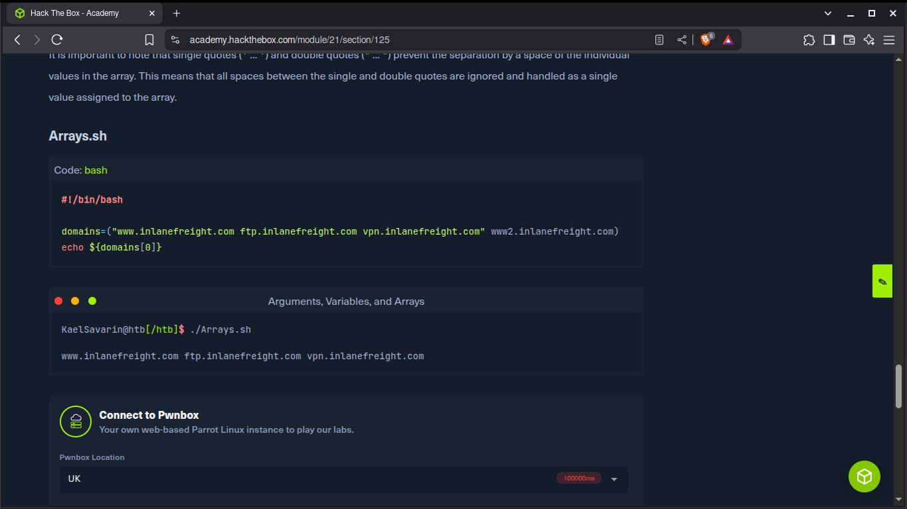

# Argumentos, Variables y Arrays


Aquí la misión es imprimir el segundo elemento de la lista

```
#!/bin/bash

domains=("www.inlanefreight.com ftp.inlanefreight.com vpn.inlanefreight.com" www2.inlanefreight.com)
echo ${domains[0]}
```

Aquí se reconocen solo 2 elementos dentro del array ya que hay tres elementoos dentro de comillas dobles,
lo cual, solo se reconoce que el array tiene dos elementos





### La Respuesta para la flag es:

```
echo ${domains[1]}
```
