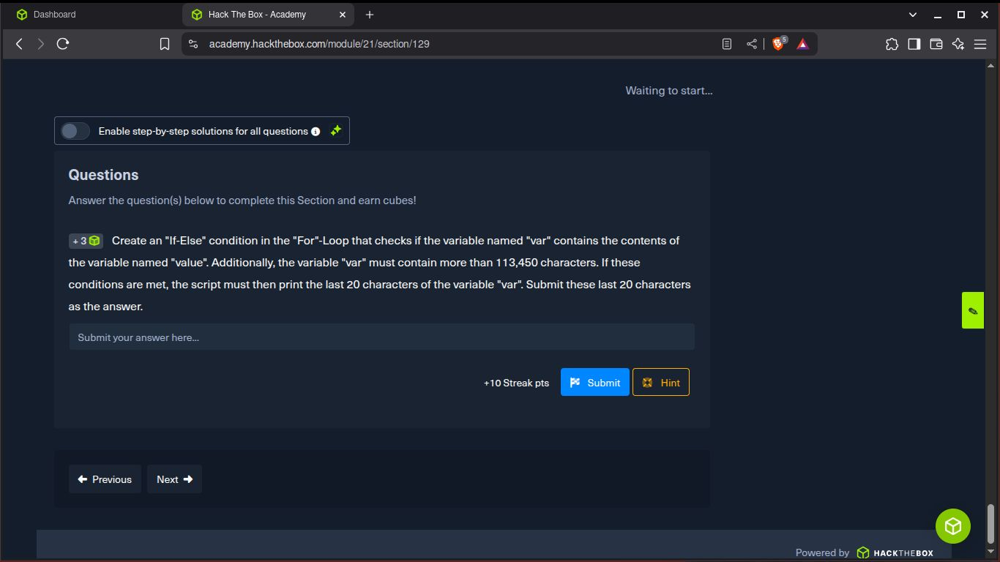
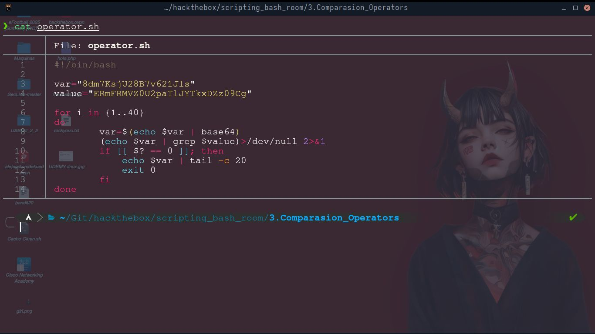

# Condicionales

Aquí me pide crear una condicional if/else dentro del bucle for para verificar si la variable "var" tiene
el mismo contenido que la variable llamada value. También la variable "var" debería contener mas que 113.450 caracteres

Si se cumplen las condiciones, el script debería de imprimir los ultimos 20 carácteres de la variable "var"
y usarlas como flag para el siguiente nivel.

Este fue el script resultado

Ahora solo copiamos los 20 carácteres resultantes para ir al siguiente nivel

